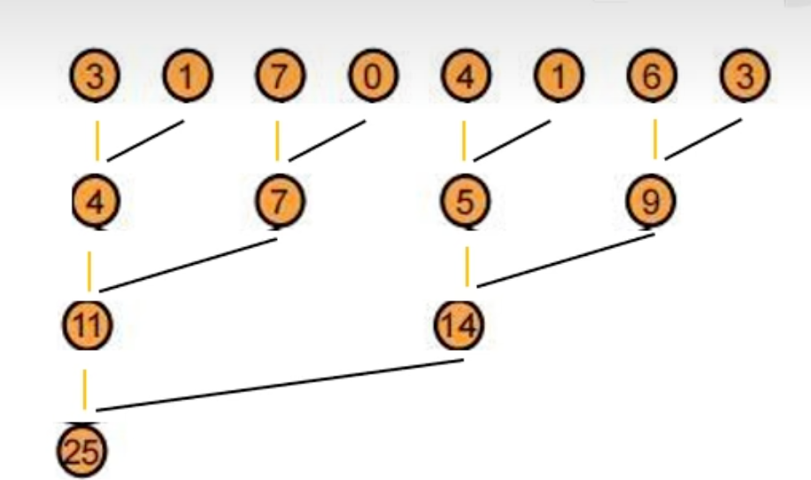
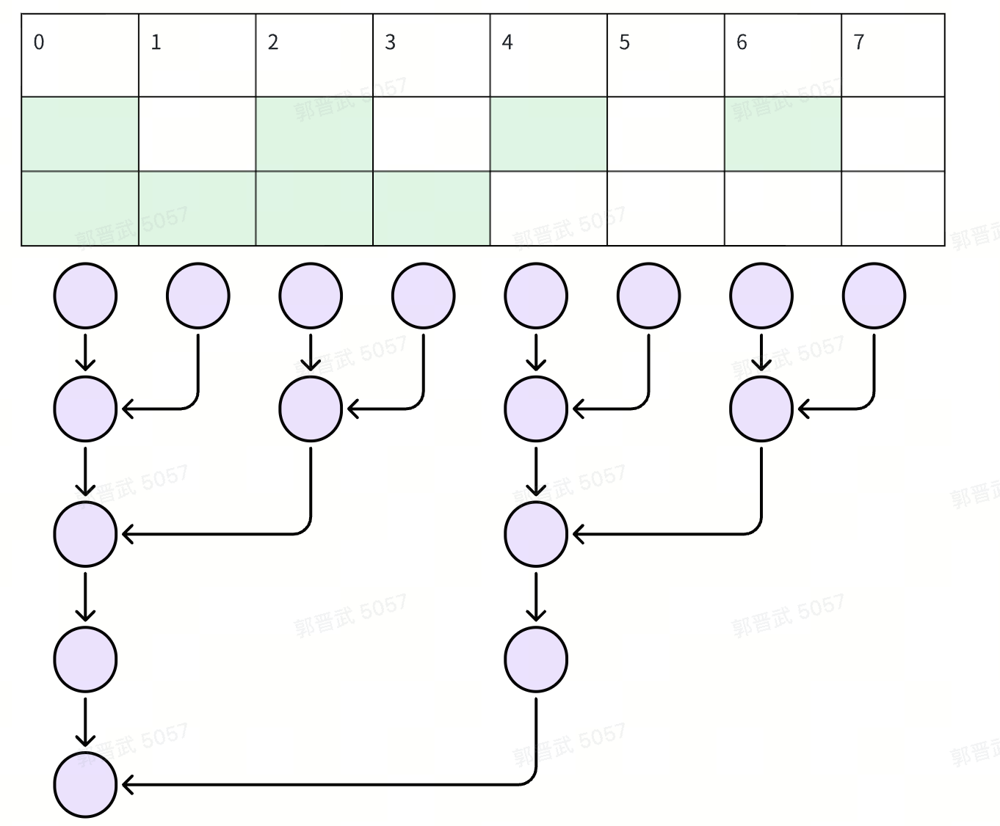

## 功能说明

### 规约操作
#### 规约算法示意图

#### warp优化示意图

规约（Reduction）是一种将数组中的多个元素合并为单个值的操作。在这个实现中，我们计算数组中所有元素的和。

### 实现方式
1. CPU 串行实现：用于验证结果的正确性
2. GPU 并行实现：使用 CUDA 进行并行计算

### 关键参数
- `N`: 输入数组大小 (32 * 1024 * 1024)
- `THREADS_PER_BLOCK`: 每个块中的线程数 (256)
- `block_num`: 块的数量 (N/THREADS_PER_BLOCK)

## 算法说明

### GPU 实现步骤
1. 将输入数组分成多个块
2. 每个块内的线程并行计算部分和
3. 将每个块的结果存储在输出数组中
4. 最后合并所有块的结果

### 内存管理
- 使用 `cudaMalloc` 在 GPU 上分配内存
- 使用 `cudaMemcpy` 在 CPU 和 GPU 之间传输数据
- 使用 `cudaFree` 释放 GPU 内存

## 编译和运行

### 编译
```bash
nvcc my_reduce.cu -o my_reduce
```

### 运行
```bash
./my_reduce
```

## 性能优化

1. 使用共享内存减少全局内存访问
2. 使用线程束（Warp）级别的优化
3. 通过调整 `THREADS_PER_BLOCK` 大小来优化性能

## 注意事项

1. 确保 GPU 有足够的显存
2. 注意内存对齐和访问模式
3. 检查 CUDA 错误处理

## 未来改进

1. 实现多级规约
2. 添加更多规约操作（如最大值、最小值等）
3. 优化内存访问模式
4. 添加性能测试和基准测试

## 参考资源

- [CUDA Programming Guide](https://docs.nvidia.com/cuda/cuda-c-programming-guide/)
- [CUDA Best Practices Guide](https://docs.nvidia.com/cuda/cuda-c-best-practices-guide/)
