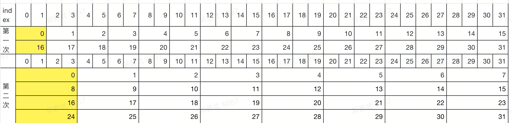

## 功能说明

### 规约操作
#### 规约算法示意图
<div class="image-center">
    
</div>

<style>
.reduce-image {
    width: 200px; /* 设置图片宽度 */
    height: auto; /* 高度自动调整，保持比例 */
}
.image-center {
    text-align: center; /* 使内容居中 */
}
.warp_image {
    width: 200px; /* 设置图片宽度 */
    height: auto; /* 高度自动调整，保持比例 */
}
</style>
#### warp优化示意图
<div class="image-center">
    
</div>
规约（Reduction）是一种将数组中的多个元素合并为单个值的操作。在这个实现中，我们计算数组中所有元素的和。

### 实现方式
1. CPU 串行实现：用于验证结果的正确性
2. GPU 并行实现：使用 CUDA 进行并行计算

### 关键参数
- `N`: 输入数组大小 (32 * 1024 * 1024)
- `THREADS_PER_BLOCK`: 每个块中的线程数 (256)
- `block_num`: 块的数量 (N/THREADS_PER_BLOCK)

## 算法说明

### GPU 实现步骤
1. 将输入数组分成多个块
2. 每个块内的线程并行计算部分和
3. 将每个块的结果存储在输出数组中
4. 最后合并所有块的结果

### 内存管理
- 使用 `cudaMalloc` 在 GPU 上分配内存
- 使用 `cudaMemcpy` 在 CPU 和 GPU 之间传输数据
- 使用 `cudaFree` 释放 GPU 内存

## 编译和运行

### 编译
```bash
nvcc my_reduce.cu -o my_reduce
```

### 运行
```bash
./my_reduce
```

## 性能优化

1. 使用共享内存减少全局内存访问
2. 使用线程束（Warp）级别的优化
3. 通过调整 `THREADS_PER_BLOCK` 大小来优化性能

### bank conflict


#### 什么是 bank conflict？
NVIDIA GPU 的共享内存被划分为多个 banks（通常是32个）。每个 bank 可以在一个周期内服务一个读或写请求。如果多个线程同时访问不同的 bank，这些访问可以并行处理；但如果多个线程尝试在同一周期内访问同一个 bank 的不同地址，则会发生 bank conflict，导致这些访问必须串行执行，从而降低性能。
✅ Warp 内部 vs 不同 Warp 之间的访问
1. Warp 内部的访问
- 在一个 warp 内部（即包含 32 个线程的一个组），如果多个线程尝试访问同一个 bank 的不同地址，就会发生 bank conflict。
- 示例：
  - 线程 0 访问 s_data[0] → bank 0
  - 线程 16 访问 s_data[16] → bank 0
- 这两个访问落在同一个 bank 上，因此会发生冲突。
2. 不同 Warp 之间的访问
- 不同 warp 之间的线程访问共享内存时，默认情况下不会产生 bank conflict，即使它们访问相同的 bank。这是因为：
- 硬件设计：GPU 的共享内存系统是为 warp 级别的并行性设计的。每个 warp 是独立调度和执行的，这意味着来自不同 warp 的访问可以并行处理，而不会相互干扰。 
- 时间间隔：由于不同 warp 的执行是交错进行的（interleaved execution），即使它们访问相同的 bank，通常也不会在同一时刻进行访问。因此，硬件能够有效地调度这些访问，避免冲突。
- 具体机制：虽然不同 warp 的线程可以同时访问同一个 bank，但因为它们属于不同的 warp，所以这些访问会被视为独立的操作，并且可以在不同的周期中完成，从而避免了冲突。

## 注意事项

1. 确保 GPU 有足够的显存
2. 注意内存对齐和访问模式
3. 检查 CUDA 错误处理

## 未来改进


1. 实现多级规约
2. 添加更多规约操作（如最大值、最小值等）
3. 优化内存访问模式
4. 添加性能测试和基准测试

## 参考资源

- [CUDA Programming Guide](https://docs.nvidia.com/cuda/cuda-c-programming-guide/)
- [CUDA Best Practices Guide](https://docs.nvidia.com/cuda/cuda-c-best-practices-guide/)
